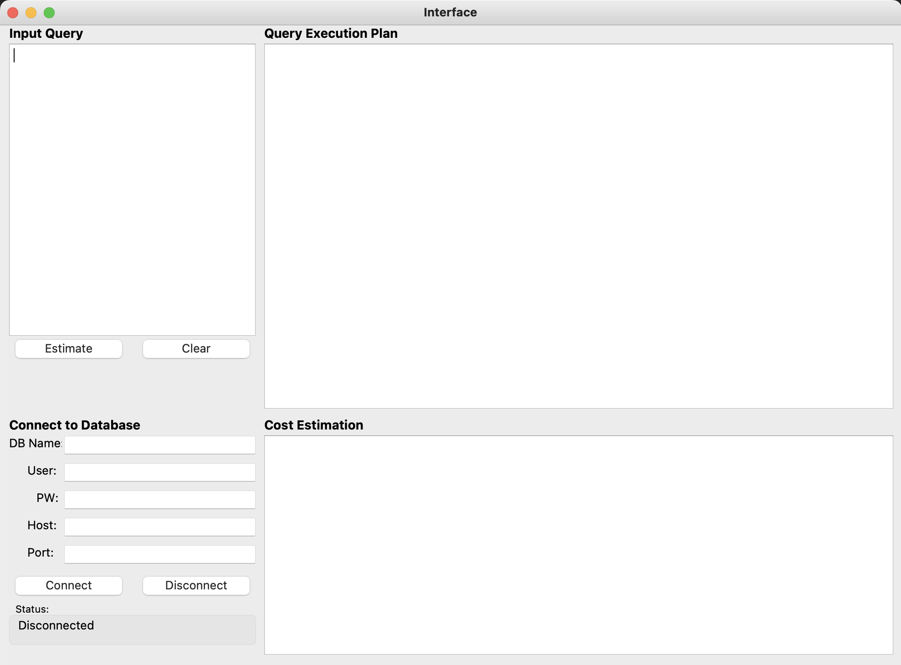
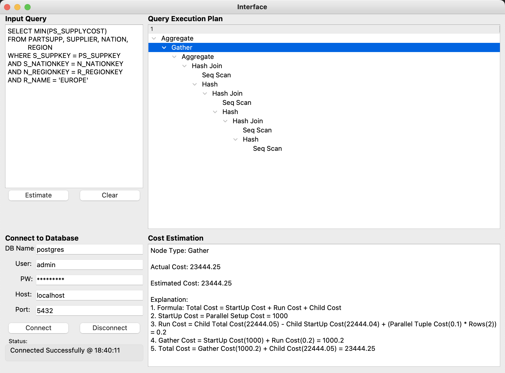

## Objective

This is project done as part of NTU SC3020 Database System Principles.

The objective is to explore how to analyze QEP plans using EXPLAIN in SQL

Most of the theory and explaination comes from looking at PostgreSQL's codebase and using postgrespro's blog(really good)

The types of QEP node operators that are covered are:

* Scans
  * Sequential Scan
  * Index only scan
* Joins
  * Nested loop join
  * Merge join
  * Hash join
* Other types
  * Aggregate
  * Gather
  * Group
  * Limit
  * Materialize
  * Sort
  * Unique

## Files

### 1. `project.py`

This is the main script of the project. It initializes the application and handles database connections, login functionality and user interface interactions.

### 2. `interface.py`

This script contains the user interface (UI) code implemented using PyQt5. It defines the UI layout, input fields, buttons, and tree view for displaying the query execution plan.

### 3. `explain.py`

This script is responsible for running the EXPLAIN command on SQL queries, analyzing the execution plans, and calculating cost estimations.

## Installation

1. Make sure you have Python 3.8 installed on your system.
2. Install the required dependencies using the following command:
   ```bash
   pip install psycopg2 PyQt5
   ```
3. Navigate to the project directory:
   ```bash
   cd Project2/
   ```
4. Run the application:
   ```bash
   python project.py
   ```

## Usage

1. Set up the database you want to query in PostgreSQL and populate with data
2. Enter your database connection details in the provided input fields.
3. Click the **Connect** button to establish a connection to the database.
4. Enter an SQL query in the text area.
5. Click the **Estimate** button to analyze the query and view the execution plan.
6. The execution query plan will be visulized in a tree view on the right side of the window. Expand the tree to view the child nodes.
7. Click the operators to view detailed information including actual costs, cost estimates and calculations

## Screenshots

Main Page


Query Page

